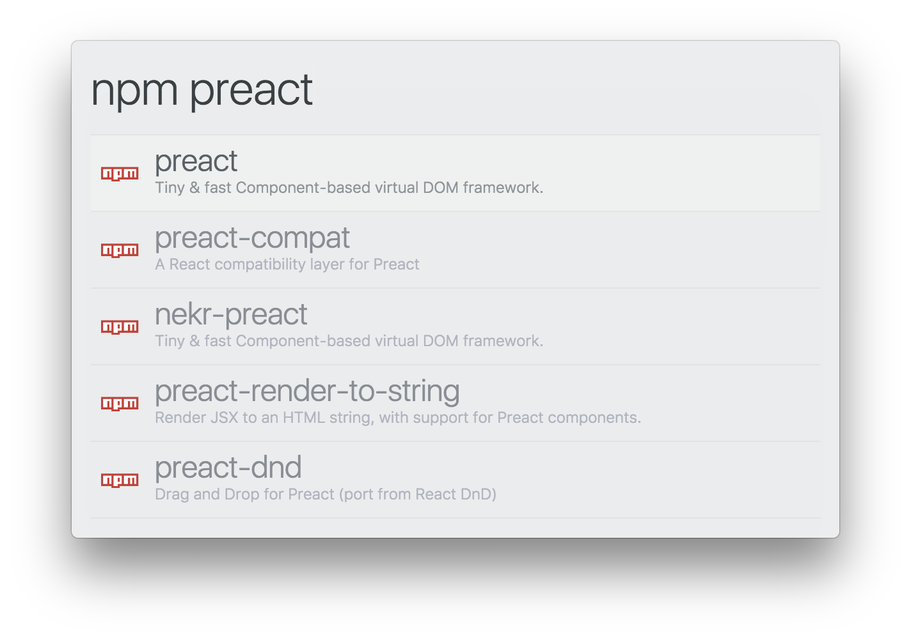

# zazu-simple-theme

> A simple theme for [Zazu](https://github.com/tinytacoteam/zazu).
> Inspired by [alfred-simple](https://github.com/sindresorhus/alfred-simple).

## Preview



## Install

Add `danielbayerlein/zazu-simple-theme` as value to `theme` inside of your `~/.zazurc.json` file.

```json
{
  "theme": "danielbayerlein/zazu-simple-theme"
}
```

## License

Copyright (c) 2017 Daniel Bayerlein. See [LICENSE](./LICENSE.md) for details.
